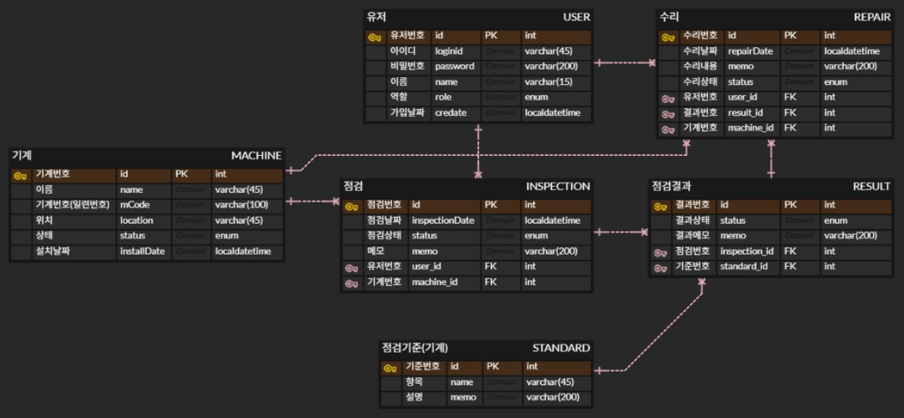

# mi_project
# 간단 정리 및 목표 (상태 중심 흐름 설계)

기계(Machine)를 대상으로  
**점검 → 결과 → 수리** 흐름을 **상태(Status) 중심**으로 관리하는 프로젝트

모든 로직 흐름은 `status(enum)` 변경으로 진행 예정

- 엔티티 : user, machine, inspection, standard(점검 기준), result, repair
  - user : 관리자, 수리자, 점검자
  - machine : nomal (기본), need_inspection (점검 필요), inspection (점검 중), error (고장), repairing (수리 중)
  - inspection : ready (점검 전), in_progress (점검 중), completed (점검 완료)
  - result : pass (통과), fail (수리 필요), need_check (보류)
  - repair : requested (요청 받음. 수리 전), in_progress (수리 중), completed (수리 완료)

  

## 대략적인 순서
  
1. 관리자가 기계를 need_inspection(점검 필요) 상태로 변경
2. 점검자가 해당 기계를 조회
3. 점검 시작하면 status 변경
    - machine의 status = inpection
    - inspection의 status = in_progress
4. 점검 기준 (standard)를 기반으로 점검 결과 판단
    - 예를 들어 모든 기준 만족 : pass, 1개라도 기준 미달 : fail or need_check (아직 설계 중)
5. 점검 결과가 fail인 것에 대해 수리자가 수리 시작
    - machine의 status : repairing
    - repair의 status : in_progress
6. 수리 완료
    - repair : completed
    - result : pass
    - machine : normal

